# Sprawozdanie z Laboratorium 3 przedmiotu Stero 25Z
**Autorzy:** Jakub Szubzda i Antonii Matczuk

**Data:** 28.11.25r

## Zadanie 1
Zgodnie z instrukcją, zweryfikowano strukturę przestrzeni pracy `stero` na bazie pakietów z Laboratorium 1 i 2. Workspace został poprawnie zbudowany i zsourcowany. Następnie uruchomiono węzeł `one_grasp`, jak w ostatnim zadaniu **labów 2** (zostało to również w dokumentacji do nich opisane)

---

## Zadanie 2: Węzeł `pick_place`

Stworzono węzeł `pick_place` na bazie `one_grasp` z poprzednich zajęć. Logika została rozszerzona o sekwencję 3-krotnego odkładania i podnoszenia obiektu. Wydzielono logikę łapania i odkładania do osobnej fukcji, która jest potem wykorzystywana w pętli for

Fragment kodu odpowiedzialny za wyznaczenie pozycji odłożenia (`T_B_place`):
```cpp
Eigen::Isometry3d T_BE = T_BO * T_OF * T_FE;
Eigen::Isometry3d T_E_pre = Eigen::Isometry3d::Identity();
T_E_pre.translation() = Eigen::Vector3d(-approach_distance_, 0.0, 0.0);
Eigen::Isometry3d T_BE_pre = T_BE * T_E_pre;
```

Pętla for wykonująca zadane ruchy (dla każdej pary x i y, podanej w parametrach `place_x_` i `place_y_`)
```cpp
place_x_ = declare_parameter<std::vector<double>>("place_x", {0.6, 0.5, 0.5, 2.0});
place_y_ = declare_parameter<std::vector<double>>("place_y", {0.0, 0.2, -0.2, 0.0});
...
size_t n_places = std::min(place_x_.size(), place_y_.size());

for (size_t i = 0; i < n_places; ++i) {
    RCLCPP_INFO(get_logger(), "Starting pick and place sequence %zu/%zu", i + 1, n_places);

    bool ok = pick_and_place(arm, gripper, mvt, place_x_[i], place_y_[i]);
    if (!ok) {
        RCLCPP_ERROR(get_logger(), "Pick and place sequence %zu failed", i + 1);
        break;
    }
    rclcpp::sleep_for(1s);
}
```
każdy punkt do odłożenia jest sprawdzany przez funkcje `check_reach` wewnątrz fukcnji `pick_place`, w momencie w którym `green_cube` zostanie już poprawnie złapany
```cpp
bool check_reach(double x, double y, const char * label) {
    double d = std::hypot(x, y);
    if (d > max_reach_) {
        RCLCPP_ERROR(get_logger(), "%s too far (%.2f > %.2f)", label, d, max_reach_);
        return false;
    }
    return true;
}
```
jeżeli zadany punkt jest **out of reach** zwracany jest błąd

---

## Zadanie 3: Testy `pick_place` dla różnych pozycji
Przeprowadzono testy dla 4 różnych pozycji startowych obiektu `green_cube_3` (3 poprawne, 1 niepoprawna):
1. (0.6, 0.0)
2. (0.5, 0.2)
3. (0.5, -0.2)
4. (2.0, 0.0) **NIEPOPRAWNA**

### Efekt uruchomienia Node-a
- robot poprawnie podniósł `green_cube_3` i odłoży w pierwsze 3 punkty
- ostatni punkt jest (`out of reach`) i powoduje następujący błąd:
    ```bash
    [move_group_interface]: MoveGroup action client/server ready
    [move_group_interface]: Planning request accepted
    [move_group_interface]: Planning request aborted
    [move_group_interface]: MoveGroupInterface::plan() failed or timeout reached
    [pick_place]: Close gripper: FAIL
    [pick_place]: Place point too far (2.00 > 1.20)
    [pick_place]: Pick and place sequence 4 failed
    [pick_place]: All sequences completed.
    ```
    wywyływany przez opisaną w *zadaniu 2* funkcje `check_reach`.
- robot wziął po uwagę stół (nie zderzył się z nim)
- końcowy wynik działąnia programu można zobaczyć na tych zrzutach ekranu (pozycje 3 wykonań i pozycja końcowa - po błędzie)

|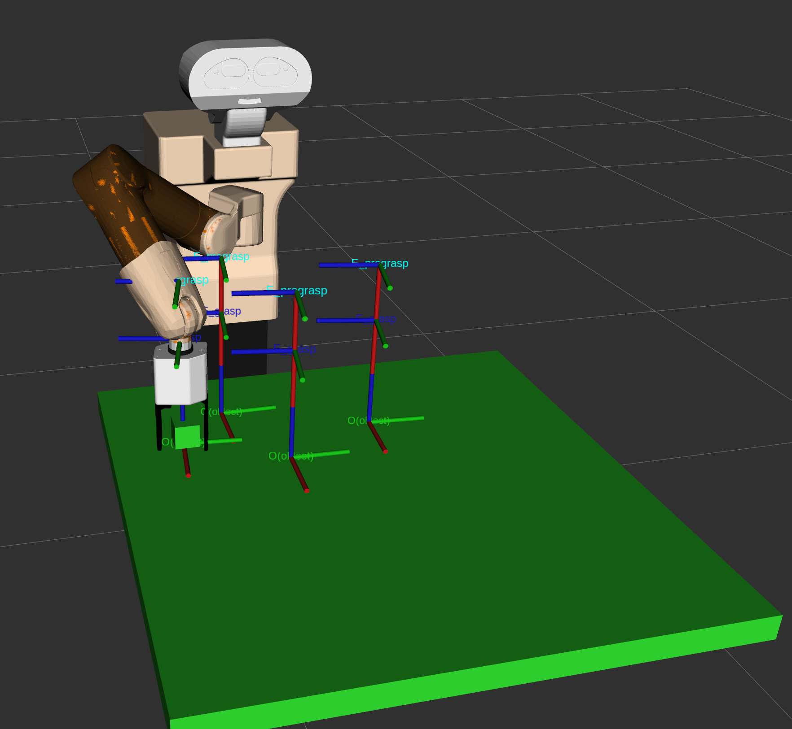 | 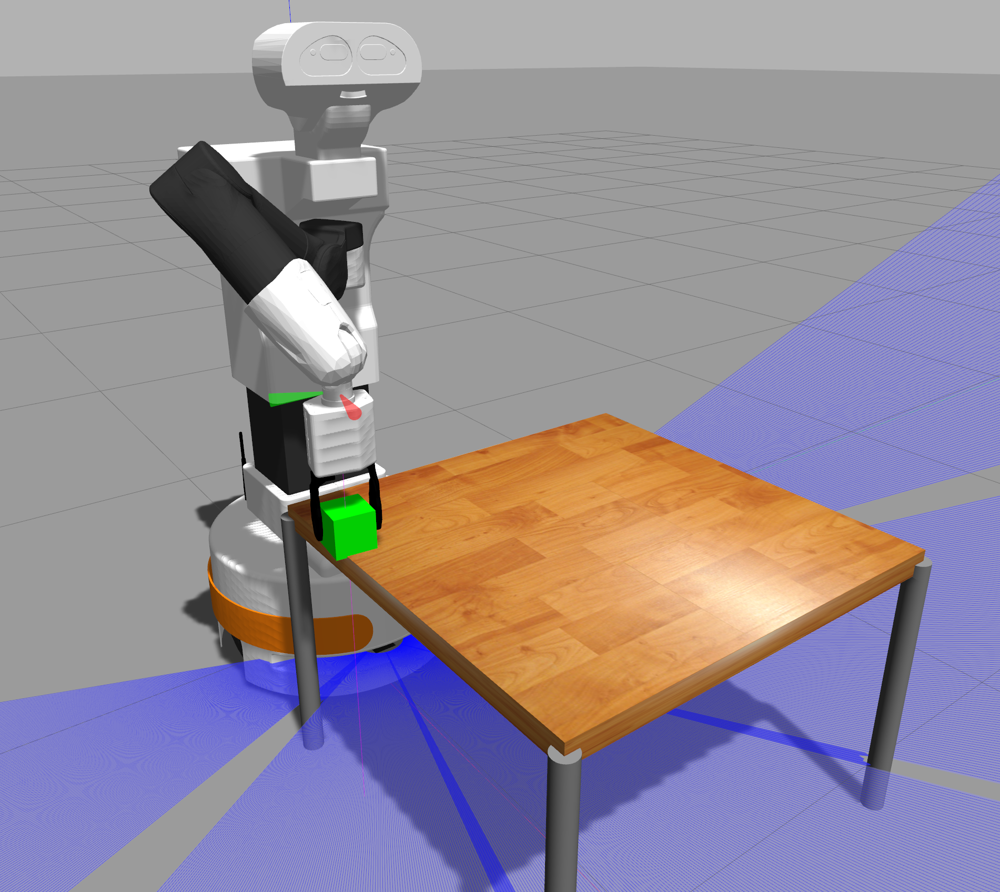 |
| --- | --- |

---

## Zadanie 4: Wyznaczanie chwytów

Celem zadania było wygenerowanie zestawu 12 potencjalnych chwytów dla obiektu `green_cube_3` od strony jednej ścianki. Zgodnie z wykładem, wykorzystano symetrię obiektu (sześcianu).

### Metodyka (Złożenie przekształceń)

Zamiast modyfikować definicję chwytu dla każdego wariantu, zdefiniowano **jeden stały chwyt wzorcowy** ($\mathcal{T}_{A7,gr}^{O_{gr}}$), a różnorodność podejść uzyskano poprzez **obracanie wirtualnego układu obiektu** ($\mathcal{T}_{O_{gr}}^{O}$).

Wzór na docelową pozycję końcówki w układzie bazy:

$$\mathcal{T}_{E,gr}^{B} = \mathcal{T}_{O}^{B} \cdot \mathcal{T}_{O_{gr}}^{O} \cdot \mathcal{T}_{A7,gr}^{O_{gr}} \cdot \mathcal{T}_{E}^{A7}$$

Gdzie:
* **$\mathcal{T}_{O}^{B}$** (`T_BO`): Rzeczywista pozycja obiektu w układzie bazy robota (pobrana z symulatora).
* **$\mathcal{T}_{O_{gr}}^{O}$** (`T_O_Ogr`): **Zmienna macierz rotacji.** Przekształcenie między rzeczywistym układem obiektu a wirtualnym układem, do którego pasuje chwyt wzorcowy. To tutaj generujemy warianty (obroty i pochylenia).
* **$\mathcal{T}_{A7,gr}^{O_{gr}}$** (`T_Ogr_F`): **Stała pozycja chwytu.** Definiuje idealny chwyt względem ścianki (np. środek chwytaka w środku ścianki, oś Z skierowana przeciwnie do normalnej ścianki).
* **$\mathcal{T}_{E}^{A7}$** (`T_FE`): Stałe przekształcenie między ostatnim ogniwem ramienia a punktem operacyjnym końcówki.

### Generowanie 12 wariantów ($\mathcal{T}_{O_{gr}}^{O}$)

Aby uzyskać 12 chwytów dla jednej ścianki, macierz $\mathcal{T}_{O_{gr}}^{O}$ jest iteracyjnie zmieniana poprzez składanie podstawowych obrotów:

1.  **Obrót osi podejścia (Roll) - 4 warianty:**
    Obrót wirtualnego obiektu wokół osi Z (oś podejścia chwytaka), co w efekcie obraca chwytak względem obiektu o $90^\circ$.
    * $RZ(0^\circ)$
    * $RZ(90^\circ)$
    * $RZ(180^\circ)$
    * $RZ(270^\circ)$

2.  **Pochylenie (Pitch) - 3 warianty:**
    Obrót wirtualnego obiektu wokół osi Y, co powoduje pochylenie chwytaka względem normalnej powierzchni (przydatne do unikania kolizji z innymi obiektami).
    * $RY(0^\circ)$
    * $RY(30^\circ)$
    * $RY(-30^\circ)$

---

## Zadanie 5: Wizualizacja chwytów (`show_side_grasps`)
- w Rviz w `global options` zmieniono `Fixed Frame` na base_footprint, żeby wizualizacja markerów lepiej działała

- Stworzono węzeł `show_side_grasps`, który iteruje po wyznaczonych chwytach i wyświetla je w RViz przy użyciu `MoveItVisualTools`. Użytkownik przełącza kolejne wizualizacje przyciskiem "Next".

- Do obliczania chwytów wykożystano w/w wzór oraz kąty.

- Dla każdego chwytu wyświetlono:
  * Model chwytaka.
  * Układ współrzędnych chwytu (Grasp).
  * Układ współrzędnych podejścia (Pre-grasp).

- W skrypcie dodano Node-a który publikuje markery z częstotliwościa określaną w parametrze `viz_rate`. Zrobiliśmy tak dlatego, że marker chwytaka znikał zaraz po opublikowaniu.

**Wizualizacje:**
| 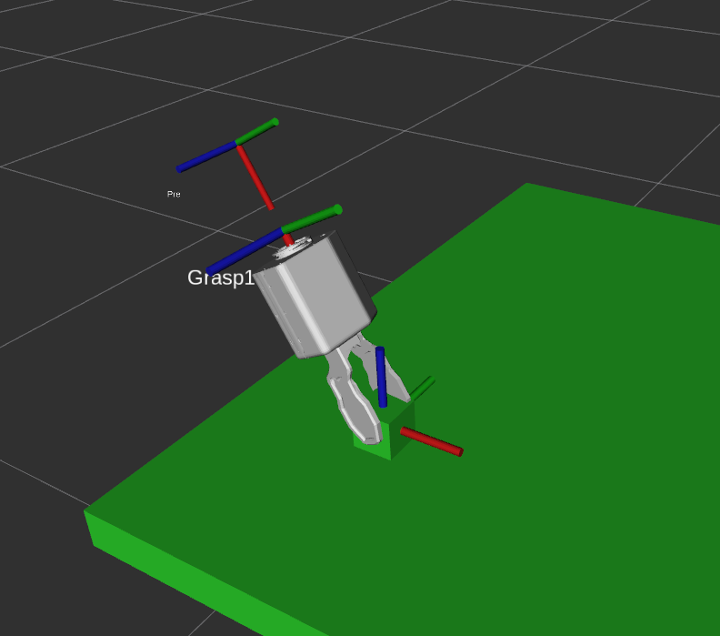 | 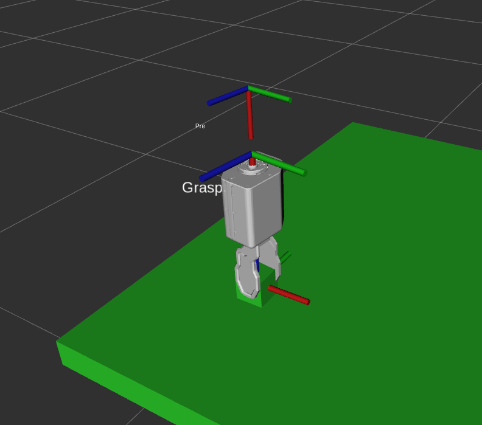 | 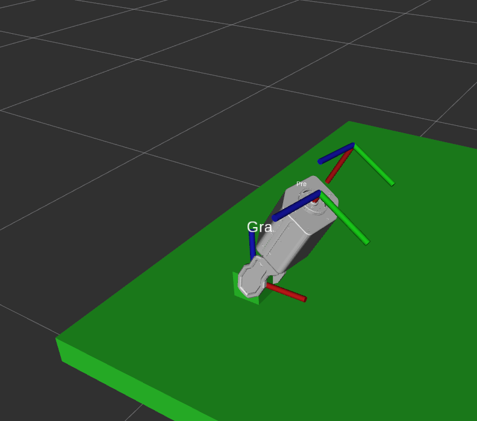 |
| --- | --- | --- |
| 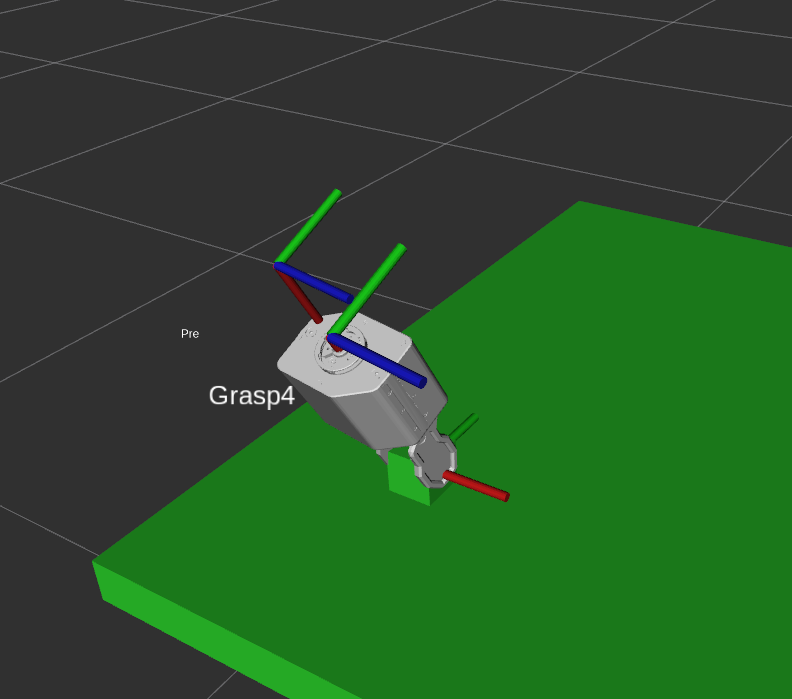 | 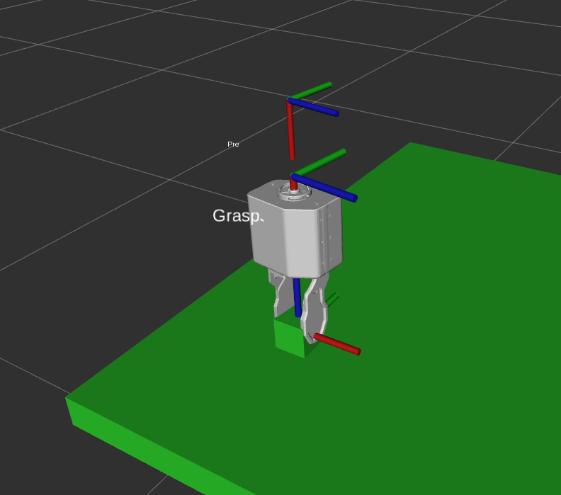 | 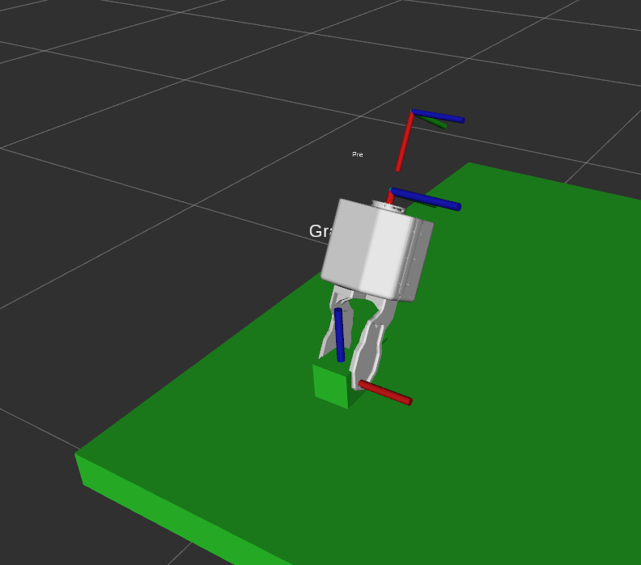 |
| 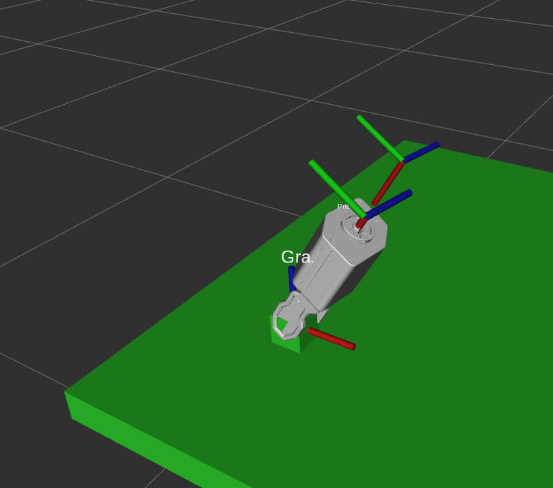 | 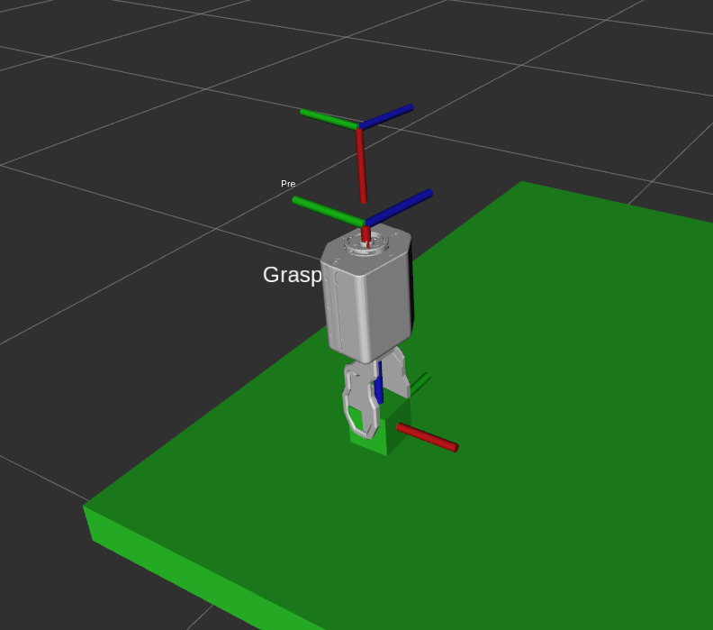 | 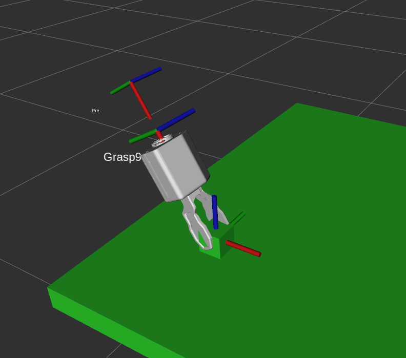 |
| 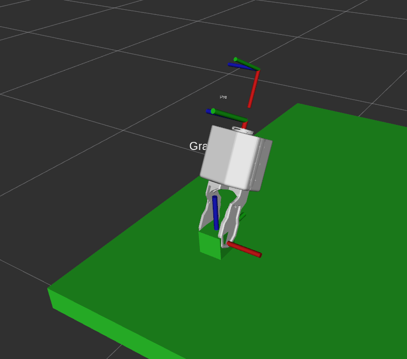 | 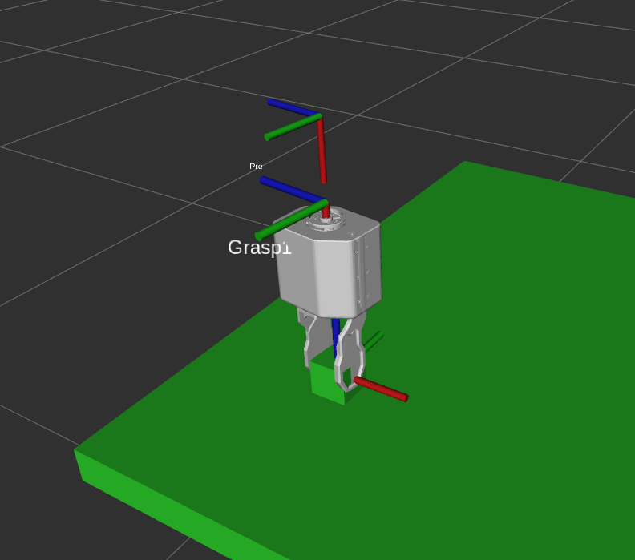 | 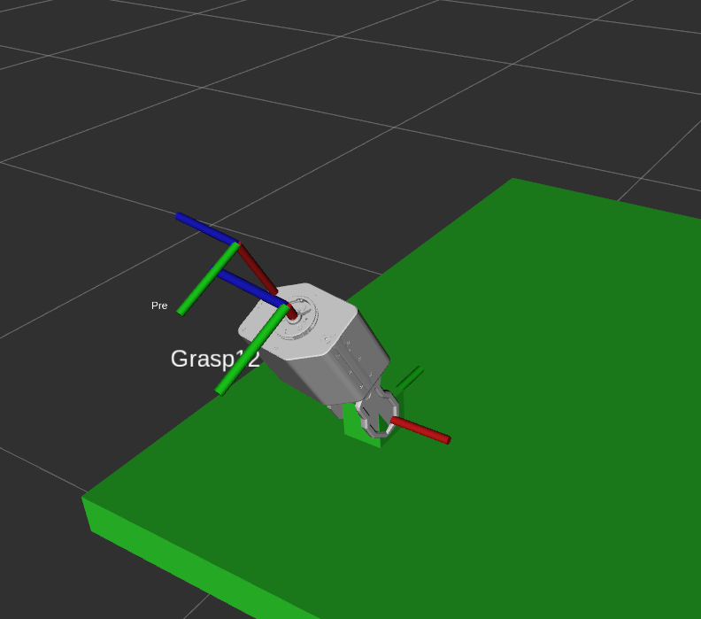 |

---

## Zadanie 6: Generacja chwytów dla każdej ścianki obiektu green_cube_3

Celem zadania było rozszerzenie algorytmu z Zadania 4 na cały obiekt, generując chwyty dla każdej z 6 ścianek sześcianu `green_cube_3`. Algorytm generuje łącznie **72 chwyty** ($6 \text{ ścian} \times 4 \text{ warianty obrotu} \times 3 \text{ warianty pochylenia}$).

### Metodyka (Złożenie przekształceń)

Podobnie jak w Zadaniu 4, wykorzystano symetrię sześcianu. Zamiast definiować osobne chwyty dla każdej ściany, manipulowano macierzą $\mathcal{T}_{O_{gr}}^{O}$, która teraz składa się z dwóch etapów rotacji: wyboru ścianki oraz lokalnego wariantu chwytu.

Wzór na docelową pozycję końcówki pozostaje bez zmian:

$$
\mathcal{T}_{E,gr}^{B} = \mathcal{T}_{O}^{B} \cdot \mathcal{T}_{O_{gr}}^{O} \cdot \mathcal{T}_{A7,gr}^{O_{gr}} \cdot \mathcal{T}_{E}^{A7}
$$

Gdzie macierz wirtualnego układu $\mathcal{T}_{O_{gr}}^{O}$ jest teraz iloczynem rotacji ścianki i rotacji lokalnej:

$$
\mathcal{T}_{O_{gr}}^{O} = T_{face} \cdot T_{local}
$$

### 1. Rotacje ścianek ($T_{face}$)

Aby pokryć cały obiekt, wirtualny układ obiektu jest obracany tak, aby oś Z (normalna ścianki) pokrywała się z osią Z chwytaka (podejścia) dla chwytu wzorcowego "od góry". Zdefiniowano następujące transformacje:

* **Góra (Top):** Brak rotacji ($\mathcal{I}$).
* **Dół (Bottom):** Obrót o $180^\circ$ wokół osi X ($Roll = \pi$).
* **Przód (Front):** Obrót o $90^\circ$ wokół osi Y ($Pitch = -\pi/2$).
* **Tył (Back):** Obrót o $-90^\circ$ wokół osi Y ($Pitch = \pi/2$).
* **Prawo (Right):** Obrót o $90^\circ$ wokół osi X ($Roll = \pi/2$).
* **Lewo (Left):** Obrót o $-90^\circ$ wokół osi X ($Roll = -\pi/2$).

### 2. Warianty lokalne ($T_{local}$)

Dla każdej ścianki generowany jest zestaw 12 chwytów poprzez iteracyjne składanie podstawowych obrotów, analogicznie do Zadania 4:

1. **Obrót osi podejścia (Roll) - 4 warianty:**
   Obrót wokół osi Z, zmieniający orientację szczęk chwytaka:
   * $RZ(0^\circ)$
   * $RZ(90^\circ)$
   * $RZ(180^\circ)$
   * $RZ(270^\circ)$

2. **Pochylenie (Pitch) - 3 warianty:**
   Obrót wokół osi Y, zmieniający kąt natarcia chwytaka:
   * $RY(0^\circ)$
   * $RY(30^\circ)$
   * $RY(-30^\circ)$

## Zadanie 7
Zaimplementowano wezeł `show_all_grasps` zgodny z powyższym opisem.

Dodano do `show_side_grasps`:
- Kalkulacje obrotów do każdej ze ścian `greec_cube_3`
    ```cpp
    std::vector<std::pair<std::string, Eigen::Isometry3d>> faces;
    faces.push_back({"Top", Eigen::Isometry3d::Identity()}); // Top
    faces.push_back({"Bottom", Eigen::Isometry3d(Eigen::AngleAxisd(M_PI, Eigen::Vector3d::UnitX()))}); // Bottom
    faces.push_back({"Front", Eigen::Isometry3d(Eigen::AngleAxisd(-M_PI/2.0, Eigen::Vector3d::UnitY()))}); // Front
    faces.push_back({"Back", Eigen::Isometry3d(Eigen::AngleAxisd(M_PI/2.0, Eigen::Vector3d::UnitY()))}); // Back
    faces.push_back({"Right", Eigen::Isometry3d(Eigen::AngleAxisd(M_PI/2.0, Eigen::Vector3d::UnitX()))}); // Right
    faces.push_back({"Left", Eigen::Isometry3d(Eigen::AngleAxisd(-M_PI/2.0, Eigen::Vector3d::UnitX()))}); // Left
    ```
- złożenie obrotu do ścianki i obrotu chwytaka wokól własnej osi oraz pochylenia
  ```cpp
    Eigen::Isometry3d T_face = face.second;
    ...
    Eigen::Isometry3d T_O_Ogr = T_face * T_local;
  ```
  `T_local` jest liczone tak samo jak w `show_side_grasps`
- pętle po każdej ze ścianek

| 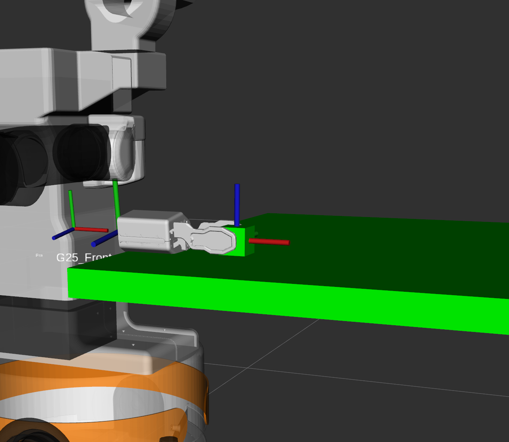 | 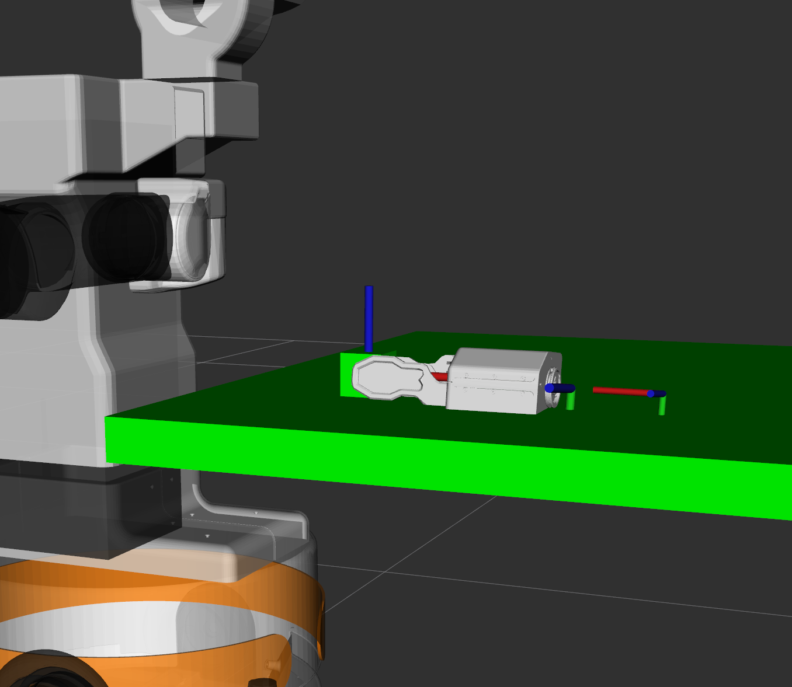 |
| --- | --- |
| 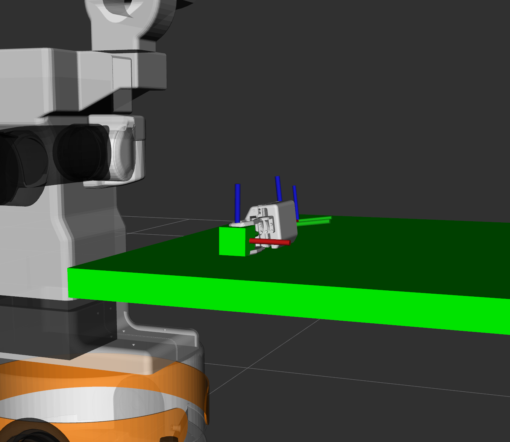 | 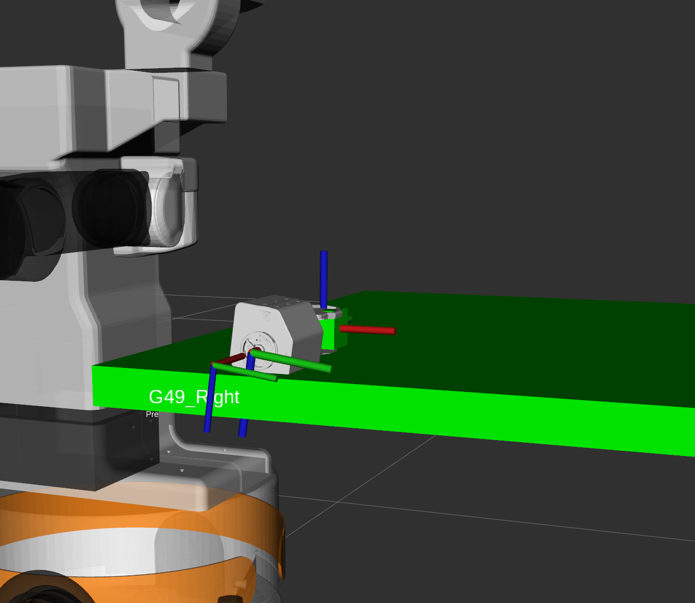 |
| 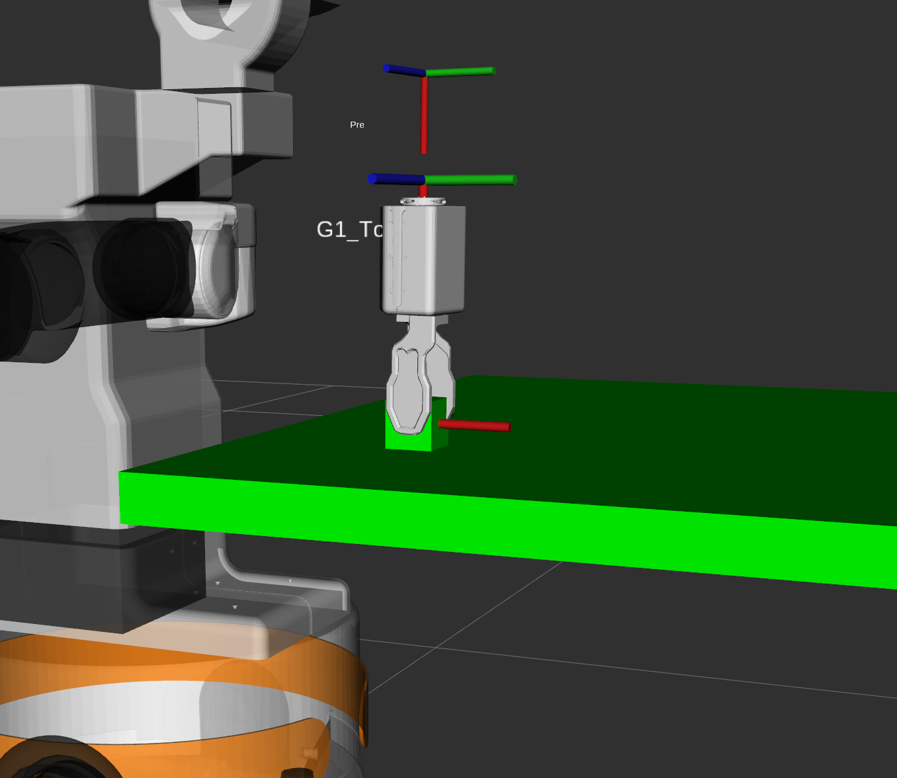 | 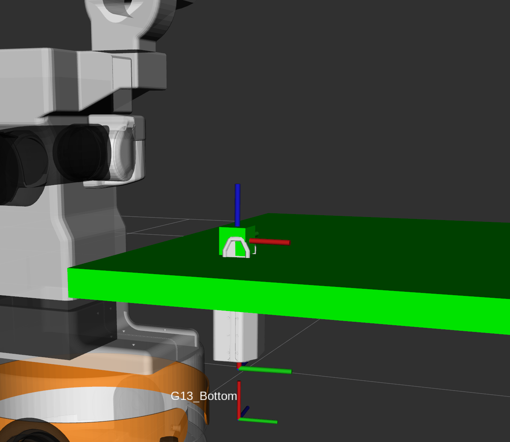 |