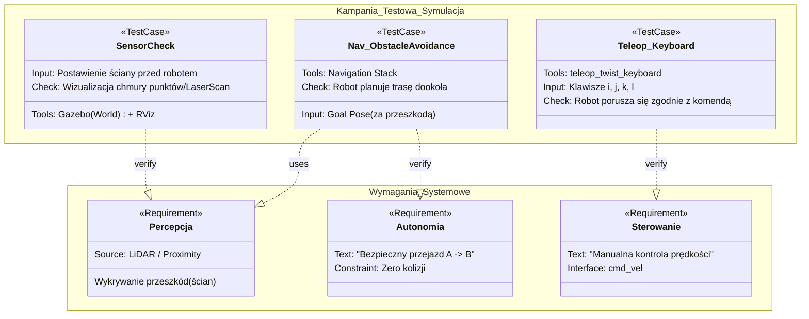

# Sprawozdanie z Laboratorium 4 STERO

## 1. Konfiguracja Środowiska

Zgodnie z instrukcją, przygotowano przestrzeń roboczą dla symulacji robota TIAGo. Proces obejmował:

1.  Pobranie repozytorium tiago przy użyciu komendy `vcs import --input https://raw.githubusercontent.com/RCPRGros-pkg/STERO2/refs/heads/iron/tiago_public_stero.repos
src
`
2.  Kompilację pakietów w workspace przy użyciu `colcon build`.
3.  Konfigurację zmiennych środowiskowych (`source install/setup.bash`).

## 2. Uruchomienie Symulacji

Symulacja została uruchomiona z pełnym stosem nawigacyjnym oraz planowaniem ruchu.

**Użyta komenda:**

```bash
ros2 launch tiago_gazebo tiago_gazebo.launch.py navigation:=True moveit:=True is_public_sim:=True
```

W celu weryfikacji drzewa transformacji (TF) użyto narzędzia:

```bash
ros2 run rqt_tf_tree rqt_tf_tree --force-discover
```

@TODO: dodac analize drzewa architektury systemu
_Pełne drzewo transformacji zostało wyeksportowane do pliku `tf_tree.pdf`._

## 3. Analiza Systemu i Sensorów

Przeprowadzono weryfikację dostępnych tematów ROS 2 oraz poprawności danych z sensorów.

| Komponent          | Temat (Topic)                                | Typ Wiadomości                | Status     | Uwagi                                    |
| :----------------- | :------------------------------------------- | :---------------------------- | :--------- | :--------------------------------------- |
| **Sterowanie**     | `/cmd_vel`                                   | `geometry_msgs/msg/Twist`     | Oczekujący | Robot stoi (brak komend)                 |
| **Odometria**      | `/mobile_base_controller/odom`               | `nav_msgs/msg/Odometry`       | **OK**     | Poprawna estymacja pozycji kół           |
| **LiDAR**          | `/scan_raw`                                  | `sensor_msgs/msg/LaserScan`   | **OK**     | **Uwaga:** Temat `/scan` jest nieaktywny |
| **Kamera RGB**     | `/head_front_camera/rgb/image_raw`           | `sensor_msgs/msg/Image`       | **OK**     | Obraz wizyjny dostępny                   |
| **Chmura Punktów** | `/head_front_camera/depth_registered/points` | `sensor_msgs/msg/PointCloud2` | **OK**     | Mapa głębi dostępna                      |

## 4. Implementacja Algorytmu Sterowania (Hexagon)

W celu realizacji zadania poruszania się po zadanej trajektorii (sześciokąt), zaimplementowano dedykowany węzeł ROS 2 w języku C++: `hexagon_mover.cpp`.

**Kluczowe cechy implementacji:**

- **Typ węzła:** `rclcpp::Node` o nazwie `hexagon_mover`.
- **Komunikacja:**
  - Publikacja sterowania prędkością na temat `/cmd_vel` (`geometry_msgs/msg/Twist`).
  - Subskrypcja odometrii z `/mobile_base_controller/odom` (do logowania pozycji).
- **Algorytm:** Prosta maszyna stanów oparta na czasie.
  - Stan 0: Jazda prosto przez wyliczony czas `move_time_`.
  - Stan 1: Obrót o 60 stopni (PI/3) przez czas `turn_time_`.
- **Parametry:** Prędkość liniowa `0.4 m/s`, prędkość kątowa `0.4 rad/s`.

Kod źródłowy węzła znajduje się w pliku `src/lab1_pkg/src/hexagon_mover.cpp`.

## 5. Weryfikacja Wizualna

Poniżej przedstawiono zrzuty ekranu dokumentujące wykonanie zadań w środowisku symulacyjnym.

### Zadanie: Hexagon


## 6. Plan Testów i Weryfikacja Wymagań (SysML)

## 4. Weryfikacja Wizualna

Poniżej przedstawiono zrzuty ekranu dokumentujące wykonanie zadań w środowisku symulacyjnym.

### Zadanie: Rysowanie wybranej figury geometrycznej (w naszym przypadku był to hexagon)


## 5. Plan Testów i Weryfikacja Wymagań (SysML)

Struktura wymagań oraz planowane przypadki testowe zostały zamodelowane w notacji SysML.



## 7. Kampania Testowa

Film prezentujący przebieg wszystkich zaplanowanych testów w symulatorze.

**https://drive.google.com/file/d/1WWmyXD8RajXPDPjqZDHNNPUAdfkwYrC2/view?usp=sharing**
