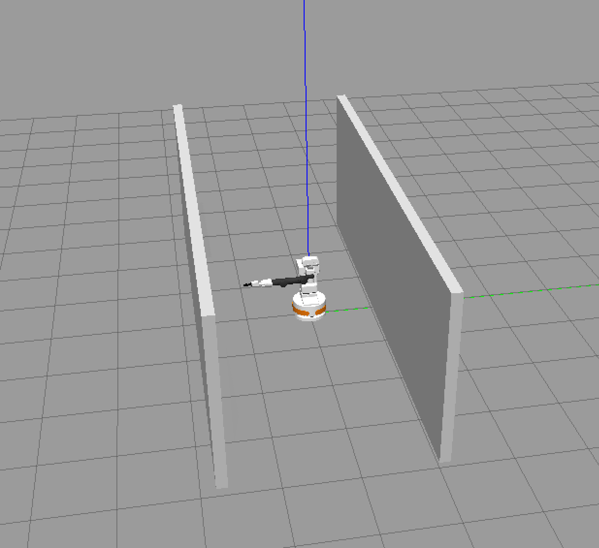
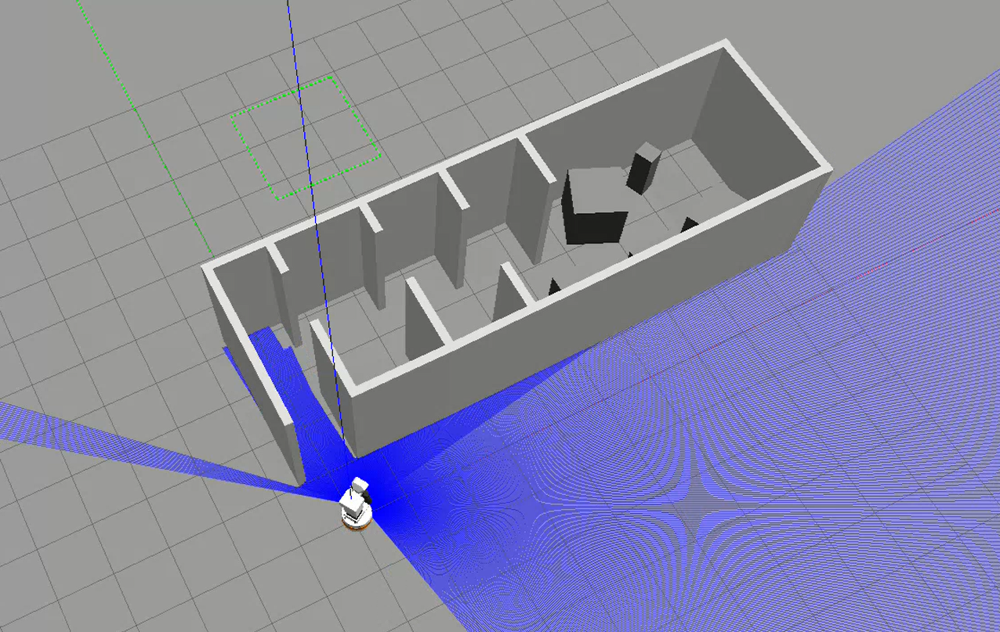

# Sprawozdanie z Laboratorium 5

## 1. Budowa światów w Gazebo
Zgodnie z instrukcją utworzono dwa modele światów przy użyciu Building Editora:
1.  **Korytarz**: Długość ok. 7m.
2.  **Mieszkanie**: Świat z pokojami bez drzwi i okien, z przejściami o szerokościach około  1.5 m, 1.7 m, 2 m i 2.5 m.

### Mapy z Building Editora
<p align="center">
  <br>
  <em>Mapa Korytarz</em>
</p>
<p align="center">
  <br>
  <em>Mapa Dom</em>
</p>

## 2. Uruchomienie symulacji
Do uruchomienia symulacji wykorzystano plik startowy `src/lab1_pkg/launch/stero_navigation.launch.py`. Poniżej przedstawiono fragment odpowiedzialny za uruchomienie symulatora Gazebo:

```python
        gazebo = include_scoped_launch_py_description(
        pkg_name='lab1_pkg',
        paths=['launch', 'pal_gazebo.launch.py'],
        env_vars=[gazebo_model_path_env_var],
        launch_arguments={
            "world_name":  launch_args.world_name,
            "world_package": launch_args.world_package,
            "model_paths": packages,
            "resource_paths": packages,
        })
```

## 3. Budowanie mapy środowiska (SLAM)
Proces budowania mapy zrealizowano przy pomocy algorytmu SLAM, manualnie przemieszczając się robotem przy użyciu `teleop_twist_keyboard`.

### Czynniki wpływające na jakość mapy
Na jakość budowanej mapy wpływają:
- dwa razy taki sam przejazd. Robot lokalizuje się za pomoca danych z lidaru i odometrii. Waga danych z lidaru jest większa niż z odometrii, co powoduje problemy w przypadku symetrycznej mapy tak jak nasza mapa korytarz. Problemy występują , ponieważ robot 
nie radzi sobie z lokalizacją na podstawie danych z lidaru(gdy mapa jest symetryczna), a odometria jest niedokładna.
- zbyt dynamiczne przemieszczanie się robotem
- kolizje (robot potrafi się z-glitch-ować i wylecieć poza mapę)

### Przebieg budowania mapy
Poniżej przedstawiono zrzuty ekranu z procesu budowania mapy oraz robota zlokalizowanego na gotowej mapie.

<p align="center">
  <br>
  <em>Budowanie mapy (niska prędkość, jeden przejazd)</em>
</p>
<p align="center">
  <br>
  <em>Budowanie mapy (wysoka prędkość, wiele przejazdów, kolizje)</em>
</p>
<p align="center">
  <br>
  <em>Robot na mapie</em>
</p>

## 4. Badanie systemu nawigacji (Węzeł `place_navigator`)
W celu przetestowania nawigacji w świecie "mieszkanie" stworzono węzeł `place_navigator` (plik `src/lab1_pkg/src/place_navigator.cpp`).

Węzeł ten pozwala na sterowanie robotem poprzez podawanie nazw miejsc docelowych zdefiniowanych w kodzie mapy:
- `fotel` (0.00, 3.52)
- `kuchenka` (1.51, 3.81)
- `wc` (2.76, 1.81)
- `sypialnia` (4.59, 3.52)

Działanie węzła zostało udokumentowane w formie nagrania wideo.
[link do filmu](https://drive.google.com/file/d/1rkf-lMdSnPVs96RlHkXl-omvpEoYbdAv/view?usp=sharing)