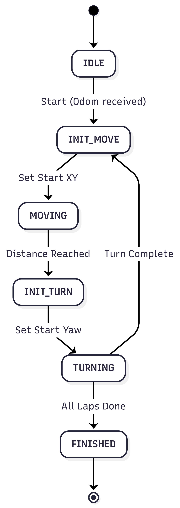
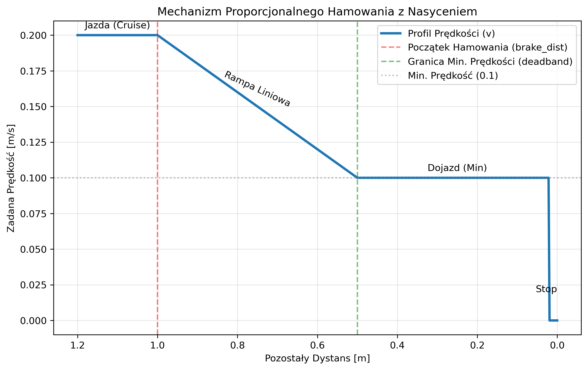
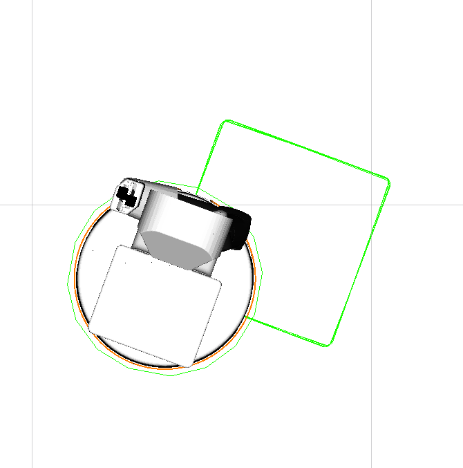
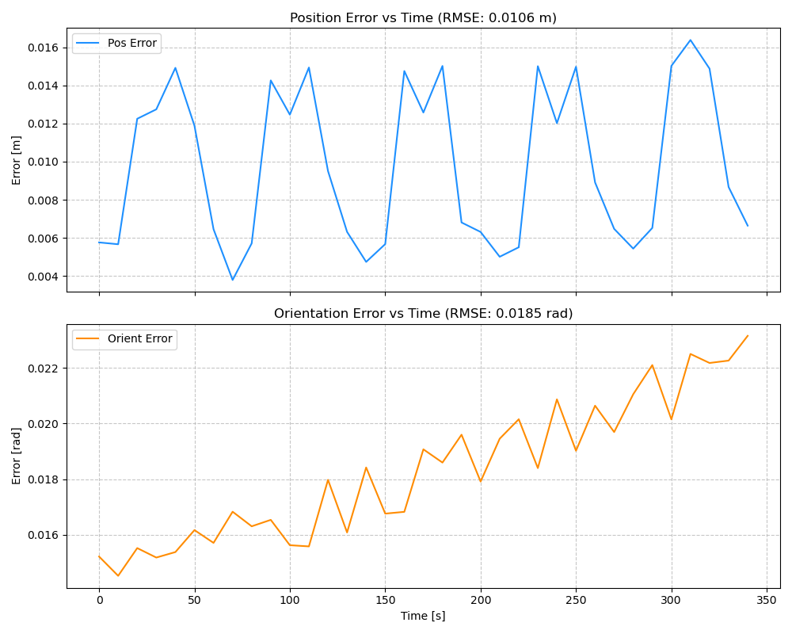
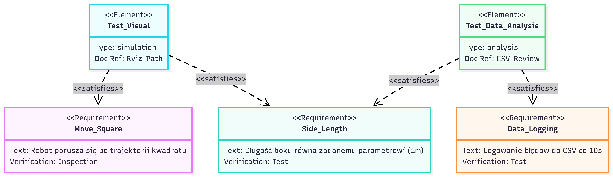

# Dokumentacja Projektu 1 z bloku nawigacji STERO 2025Z
## 1. Wstęp i Cel Zadania

Celem projektu było stworzenie węzła ROS 2 sterującego robotem mobilnym (TIAGo) tak, aby poruszał się on po trajektorii kwadratu. Kluczowym aspektem zadania była nie tylko realizacja ruchu, ale również weryfikacja jego dokładności poprzez porównanie odometrii robota z danymi referencyjnymi (Ground Truth) oraz logowanie błędów.

## 2. Implementacja Algorytmu Sterowania

Zadanie zrealizowano poprzez implementację węzła `SquareMover` w języku C++. Sterowanie opiera się na precyzyjnej maszynie stanów, która zarządza sekwencją ruchów prostoliniowych oraz obrotów.

### 2.1. Maszyna Stanów

Logika sterowania została podzielona na następujące stany, co zapewnia deterministyczne zachowanie robota:

  

### 2.2. Opis Stanów

*   **IDLE**: Oczekiwanie na pierwsze dane z odometrii.
*   **INIT_MOVE**: Inicjalizacja odcinka prostego. Zapisanie aktualnej pozycji (X, Y) jako punktu startowego.
*   **MOVING**: Jazda prosto (regulacja prędkości liniowej).
    *   Robot monitoruje przebyty dystans.
    *   Wdrożono **mechanizm predykcyjnego hamowania**.
*   **INIT_TURN**: Inicjalizacja obrotu. Zapisanie aktualnego kąta (Yaw). Wyznaczenie celu obrotu (+/- 90 stopni).
*   **TURNING**: Obrót w miejscu (regulacja prędkości kątowej).
    *   Monitorowanie różnicy kątowej.
    *   Zastosowano analogiczny mechanizm hamowania dla ruchu obrotowego.
*   **FINISHED**: Zakończenie zadania, zatrzymanie robota i wygenerowanie raportu końcowego.

### 2.3. Mechanizm Proporcjonalnego Hamowania

W celu eliminacji przeregulowań (overshoot) oraz zapewnienia precyzji zatrzymania, zaimplementowano trójfazowy regulator prędkości dla obu osi sterowania (liniowej i kątowej).

Zależność sterowania od błędu (pozostałego dystansu $d$) wyraża się wzorem:

$$ v(d) = \begin{cases} v_{cruise} & \text{dla } d > d_{brake} \\ \max(v_{min}, v_{cruise} \cdot \frac{d}{d_{brake}}) & \text{dla } d_{stop} < d \le d_{brake} \\ 0 & \text{dla } d \le d_{stop} \end{cases} $$

Gdzie:
*   $d_{brake}$ - dystans rozpoczęcia hamowania (parametr `linear_brake_dist`).
*   $v_{cruise}$ - prędkość przelotowa (0.2 m/s).
*   $v_{min}$ - minimalna prędkość (0.1 m/s), zapobiegająca utknięciu robota w martwej strefie napędu (deadband) przy małych wysterowaniach.
*   $d_{stop}$ - tolerancja celu (0.02 m).

**Wizualizacja profilu prędkości:**

Mechanizm ten pozwala na szybki dolot do celu (faza Cruise), płynne wytracenie pędu (faza Rampa) oraz precyzyjne "doklejenie" do punktu docelowego na minimalnej prędkości (faza Dojazd).

### 2.4. Parametryzacja i Bezwładność

Węzeł obsługuje parametry ROS, umożliwiające strojenie regulatora:

*   `square_len`: Długość boku kwadratu.
*   `laps`: Liczba okrążeń.
*   `direction`: Kierunek obrotu.
*   `linear_brake_dist` / `angular_brake_dist`: Zasięgi strefy hamowania.
*   **`inertia_factor`**: Współczynnik bezwładności (mnożnik).
    *   Modyfikuje on efektywną wartość `break_dist` ($d_{brake_{eff}} = d_{brake} \cdot inertia\_factor$).
    *   Zwiększenie tego parametru wydłuża drogę hamowania, co jest przydatne dla cięższych robotów lub śliskich nawierzchni, pozwalając na wcześniejszą redukcję prędkości.

## 3. Logowanie Danych i Analiza Błędów

Program równolegle do sterowania prowadzi akwizycję danych pomiarowych.

*   **Subskrypcje**:
    *   `/mobile_base_controller/odom`: Estymowana pozycja robota (Odometria).
    *   `/ground_truth_odom`: Rzeczywista pozycja robota (Symulator).

*   **Metryka Błędu**:
    Co 10 sekund obliczany i zapisywany jest błąd średniokwadratowy (MSE) pozycji oraz orientacji względem danych referencyjnych.
    Format zapisu w pliku CSV:
    `timestamp, pos_err_sq, orient_err_sq`

## 4. Wyniki Eksperymentu

Poniżej przedstawiono wyniki przeprowadzonej symulacji dla zadanej trasy kwadratu.

### 4.1. Wizualizacja Odometrii i Trajektorii

Poniższy zrzut ekranu z oprogramowania Rviz (Placeholder) przedstawia ścieżkę wyrysowaną przez robota na podstawie opublikowanego tematu `/path`. Węzeł `square_mover` publikuje na ten temat wiadomości typu `nav_msgs/msg/Path`, które zawierają historię pozycji robota (Stamped Pose). W Rviz dodano element wizualizacyjny subskrybujący ten temat, co pozwala na ciągłe rysowanie śladu przebytej drogi.

### 4.2. Wykres Błędów

Analiza błędów pozycji i orientacji w czasie trwania eksperymentu.

### 4.3. Tabela Wyników

Zbiorcze zestawienie błędów (MSE) dla poszczególnych prób testowych.

| Próba | Parametry (Bok / Okrążenia) | MSE Pozycji ($m^2$) | MSE Orientacji ($rad^2$) | Uwagi |
| :--- | :--- | :--- | :--- | :--- |
| 1 | 0.5m / 5 | 0.000113255 | 0.000342069 | Dir: CW, Inertia: 0.71 |
| 2 | 0.5m / 5 | 0.234866 | 0.333799 | Dir: CCW, Inertia: 0.71 |
| 3 | 0.5m / 20 | 1.83176 | 0.975269 | Dir: CW, Inertia: 0.71 |

## 6. Weryfikacja Wymagań 

Poniższy diagram przedstawia zamodelowaną strukturę zależności między wymaganiami projektowymi a przypadkami testowymi weryfikującymi ich spełnienie.

## 5. Podsumowanie

Zaimplementowany sterownik poprawnie realizuje zadaną trajektorię. Zastosowanie maszyny stanów oraz faz hamowania pozwoliło na osiągnięcie płynnego ruchu i minimalizację błędów przeregulowania na wierzchołkach kwadratu. System logowania umożliwia ilościową ocenę jakości sterowania poprzez porównanie z Ground Truth. Poniżej znajduje się link do nagrania z przykładowego wywołania systemu:
https://drive.google.com/file/d/1k9RqEFk71ymbJgjONm4UJkHN9Kmb7CGk/view?usp=sharing
