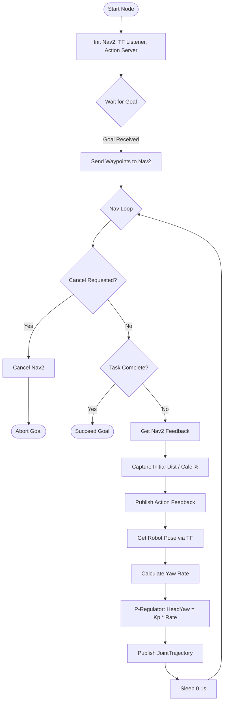
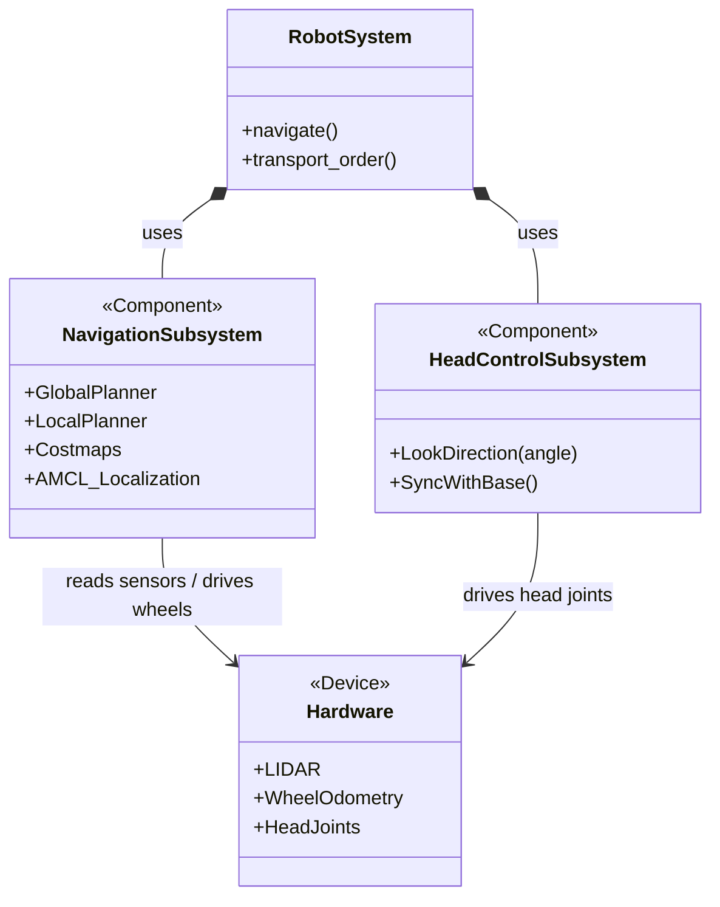

# Project 2: Report Resources

This document contains resources for the Project 2 report (Navigation Node with Head Control).

## 1. Running the System

**Launch Simulation:**
```bash
# Terminal 1
source install/setup.bash
./bash_scripts/lab5_launch.sh
```

**Run the Action Server Node:**
```bash
# Terminal 2
source install/setup.bash
ros2 run lab1_pkg lab2_p2_node.py
```

**Run the Test Client (to trigger the action):**
```bash
# Terminal 3
source install/setup.bash
ros2 run lab1_pkg test_p2_client.py
```

---

## 2. Feedback Implementation (Requirement 1 & 2)

We use `nav2_simple_commander`'s feedback mechanism.
*   **Original Method (Replaced):** Calculating Euclidean distance between waypoints. This was inaccurate because it ignored the robot's actual planned path around obstacles.
*   **Current Method:** We capture the **initial** `distance_remaining` reported by Nav2 when the goal starts. This value comes directly from the planner and represents the true path length.
*   **Formula:** `Percentage = 100 * (1 - (current_distance_remaining / initial_distance_remaining))`

**Code Snippet:**
```python
# Capture true path length from Nav2
if original_total_dist is None and dist_rem > 0.1:
    original_total_dist = dist_rem

# Calculate Ratio
ratio = 1.0 - (dist_rem / original_total_dist)
feedback_msg.percentage_complete = ratio * 100.0
```

---

## 3. Head Control - Proportional Regulator (Requirement 4)

To ensure **smooth** movement synchronized with the base, we implemented a **Proportional (P) Controller**.
*   **Input:** Robot's Yaw Rate (`yaw_diff` per 0.1s loop).
*   **Output:** Head Pan Angle (`head_1_joint`).
*   **Logic:** The faster the robot turns left, the more the head looks left.
*   **Smoothing:** `JointTrajectory` points are sent with `time_from_start=0.1s` to match the control loop rate, ensuring smooth interpolation by the hardware controller.

**Code Snippet:**
```python
# P-Controller Logic
head_kp = 3.0
target_head_yaw = head_kp * yaw_diff

# Create Trajectory Point (0.1s duration)
point.positions = [float(target_head_yaw), 0.0] 
point.time_from_start.nanosec = 100000000 # 0.1 seconds
```

---

## 4. Activity Diagram (Node Logic)

**Mermaid Diagram:**


---

## 5. System Architecture (Robot Waiter) - Object-Process Diagram (OPD) Concept

Since verified OPD tools are specific, here is a conceptual block diagram representing the Architecture as described.

**Mermaid Diagram (Architecture Level):**



**OPD Description (for Report):**
*   **Objects:** Robot, Cafe Map, Order, Customer, Obstacle.
*   **Processes:** Navigating (State: Idle -> Moving -> Arrived), Avoiding Obstacles, Stabilizing Head.
*   **Relations:**
    *   *Navigating* requires *Map* and *Robot*.
    *   *Navigating* changes *Robot* state from *At Source* to *At Destination*.
    *   *Avoiding Obstacles* affects *Navigating*.
    *   *Stabilizing Head* runs parallel to *Navigating* (zooming into the Navigation process).

---

## 6. Full Code Listings

### `NavigateToWaypoints.action`
```ros
# Goal
geometry_msgs/Point[] waypoints
---
# Result
bool success
---
# Feedback
float32 percentage_complete
```

### `lab2_p2_node.py` (Selected Functions)
*(See actual file for full listing)*
#!/usr/bin/env python3

import rclpy
from rclpy.node import Node
from rclpy.action import ActionServer
from rclpy.callback_groups import ReentrantCallbackGroup
from rclpy.executors import MultiThreadedExecutor
from geometry_msgs.msg import Point, PoseStamped
from trajectory_msgs.msg import JointTrajectory, JointTrajectoryPoint
from nav2_simple_commander.robot_navigator import BasicNavigator, TaskResult
from lab1_pkg.action import NavigateToWaypoints
import math
import time
from tf2_ros import Buffer, TransformListener, LookupException, ConnectivityException, ExtrapolationException

class Lab2P2Node(Node):

    def __init__(self):
        super().__init__('lab2_p2_node')
        
        self.navigator = BasicNavigator()
        
        # TF Buffer for getting robot pose
        self.tf_buffer = Buffer()
        self.tf_listener = TransformListener(self.tf_buffer, self)
        
        self._action_server = ActionServer(
            self,
            NavigateToWaypoints,
            'navigate_to_waypoints',
            self.execute_callback,
            callback_group=ReentrantCallbackGroup())
            
        self.head_pub = self.create_publisher(
            JointTrajectory, 
            'head_controller/joint_trajectory', 
            10)
            
        self.get_logger().info('Lab2 Project 2 Node has been started.')

    def get_robot_pose(self):
        try:
            # Look up transform from map to base_link
            t = self.tf_buffer.lookup_transform(
                'map',
                'base_link',
                rclpy.time.Time())
                
            pose = PoseStamped()
            pose.header = t.header
            pose.pose.position.x = t.transform.translation.x
            pose.pose.position.y = t.transform.translation.y
            pose.pose.position.z = t.transform.translation.z
            pose.pose.orientation = t.transform.rotation
            return pose
        except (LookupException, ConnectivityException, ExtrapolationException):
            return None

    def execute_callback(self, goal_handle):
        self.get_logger().info('Executing goal...')
        waypoints = goal_handle.request.waypoints
        
        if not waypoints:
            self.get_logger().warn('No waypoints received!')
            goal_handle.succeed()
            result = NavigateToWaypoints.Result()
            result.success = True
            return result

        # Create PoseStamped list
        poses = []
        for pt in waypoints:
            pose = PoseStamped()
            pose.header.frame_id = 'map'
            pose.header.stamp = self.navigator.get_clock().now().to_msg()
            pose.pose.position.x = pt.x
            pose.pose.position.y = pt.y
            pose.pose.position.z = 0.0
            pose.pose.orientation.w = 1.0 
            poses.append(pose)

        # No pre-calculation of distance here. We will capture the true path length from Nav2 feedback.
        original_total_dist = None

        # Start Navigation
        self.navigator.goThroughPoses(poses)

        feedback_msg = NavigateToWaypoints.Feedback()
        
        last_yaw = 0.0
        # Initialize last_yaw from current pose if available
        if current_pose_check:
            q = current_pose_check.pose.orientation
            siny_cosp = 2 * (q.w * q.z + q.x * q.y)
            cosy_cosp = 1 - 2 * (q.y * q.y + q.z * q.z)
            last_yaw = math.atan2(siny_cosp, cosy_cosp)
        
        # Head control parameters
        head_kp = 3.0  # Proportional gain for head looking into turn
        max_head_pan = 1.0 # Limit head range
        
        while not self.navigator.isTaskComplete():
            if goal_handle.is_cancel_requested:
                goal_handle.canceled()
                self.navigator.cancelTask()
                self.get_logger().info('Goal canceled')
                return NavigateToWaypoints.Result(success=False)

            # --- Feedback ---
            nav_feedback = self.navigator.getFeedback()
            if nav_feedback:
                dist_rem = nav_feedback.distance_remaining
                
                # Capture the initial full path length reported by Nav2 (once)
                if original_total_dist is None and dist_rem > 0.1:
                    original_total_dist = dist_rem
                    self.get_logger().info(f'Initial path length captured: {original_total_dist:.2f} m')
                
                ratio = 0.0
                if original_total_dist and original_total_dist > 0:
                    ratio = 1.0 - (dist_rem / original_total_dist)
                
                if ratio < 0: ratio = 0.0
                if ratio > 1: ratio = 1.0
                
                feedback_msg.percentage_complete = ratio * 100.0
                goal_handle.publish_feedback(feedback_msg)

            # --- Head Control (Proportional Regulator) ---
            current_pose = self.get_robot_pose()
            if current_pose:
                # Calculate yaw
                q = current_pose.pose.orientation
                siny_cosp = 2 * (q.w * q.z + q.x * q.y)
                cosy_cosp = 1 - 2 * (q.y * q.y + q.z * q.z)
                current_yaw = math.atan2(siny_cosp, cosy_cosp)
                
                yaw_diff = current_yaw - last_yaw
                while yaw_diff > math.pi: yaw_diff -= 2*math.pi
                while yaw_diff < -math.pi: yaw_diff += 2*math.pi
                
                last_yaw = current_yaw
                
                # P-Controller: Head angle proportional to turning rate (yaw_diff per 0.1s)
                # If turning LEFT (positive yaw_diff), look LEFT (positive head_yaw)
                target_head_yaw = head_kp * yaw_diff
                
                # Clamp limits
                if target_head_yaw > max_head_pan: target_head_yaw = max_head_pan
                if target_head_yaw < -max_head_pan: target_head_yaw = -max_head_pan
                
                traj = JointTrajectory()
                traj.joint_names = ['head_1_joint', 'head_2_joint']
                point = JointTrajectoryPoint()
                point.positions = [float(target_head_yaw), 0.0] 
                # Match time to sleep duration for smooth stream
                point.time_from_start.sec = 0
                point.time_from_start.nanosec = 100000000 # 0.1s
                traj.points.append(point)
                self.head_pub.publish(traj)
            
            time.sleep(0.1)

        result = self.navigator.getResult()
        if result == TaskResult.SUCCEEDED:
            self.get_logger().info('Goal succeeded!')
            goal_handle.succeed()
            res = NavigateToWaypoints.Result()
            res.success = True
            return res
        elif result == TaskResult.CANCELED:
            self.get_logger().info('Goal was canceled!')
            goal_handle.canceled()
            res = NavigateToWaypoints.Result()
            res.success = False
            return res
        elif result == TaskResult.FAILED:
            self.get_logger().info('Goal failed!')
            goal_handle.abort()
            res = NavigateToWaypoints.Result()
            res.success = False
            return res
        else:
            self.get_logger().info('Goal has an invalid return status!')
            goal_handle.abort()
            res = NavigateToWaypoints.Result()
            res.success = False
            return res

def main(args=None):
    rclpy.init(args=args)
    node = Lab2P2Node()
    
    executor = MultiThreadedExecutor()
    executor.add_node(node)
    
    try:
        executor.spin()
    except KeyboardInterrupt:
        pass
    finally:
        node.destroy_node()
        rclpy.shutdown()

if __name__ == '__main__':
    main()
#!/usr/bin/env python3

import rclpy
from rclpy.node import Node
from rclpy.action import ActionServer
from rclpy.callback_groups import ReentrantCallbackGroup
from rclpy.executors import MultiThreadedExecutor
from geometry_msgs.msg import Point, PoseStamped
from trajectory_msgs.msg import JointTrajectory, JointTrajectoryPoint
from nav2_simple_commander.robot_navigator import BasicNavigator, TaskResult
from lab1_pkg.action import NavigateToWaypoints
import math
import time
from tf2_ros import Buffer, TransformListener, LookupException, ConnectivityException, ExtrapolationException

class Lab2P2Node(Node):

    def __init__(self):
        super().__init__('lab2_p2_node')
        
        self.navigator = BasicNavigator()
        
        # TF Buffer for getting robot pose
        self.tf_buffer = Buffer()
        self.tf_listener = TransformListener(self.tf_buffer, self)
        
        self._action_server = ActionServer(
            self,
            NavigateToWaypoints,
            'navigate_to_waypoints',
            self.execute_callback,
            callback_group=ReentrantCallbackGroup())
            
        self.head_pub = self.create_publisher(
            JointTrajectory, 
            'head_controller/joint_trajectory', 
            10)
            
        self.get_logger().info('Lab2 Project 2 Node has been started.')

    def get_robot_pose(self):
        try:
            # Look up transform from map to base_link
            t = self.tf_buffer.lookup_transform(
                'map',
                'base_link',
                rclpy.time.Time())
                
            pose = PoseStamped()
            pose.header = t.header
            pose.pose.position.x = t.transform.translation.x
            pose.pose.position.y = t.transform.translation.y
            pose.pose.position.z = t.transform.translation.z
            pose.pose.orientation = t.transform.rotation
            return pose
        except (LookupException, ConnectivityException, ExtrapolationException):
            return None

    def execute_callback(self, goal_handle):
        self.get_logger().info('Executing goal...')
        waypoints = goal_handle.request.waypoints
        
        if not waypoints:
            self.get_logger().warn('No waypoints received!')
            goal_handle.succeed()
            result = NavigateToWaypoints.Result()
            result.success = True
            return result

        # Create PoseStamped list
        poses = []
        for pt in waypoints:
            pose = PoseStamped()
            pose.header.frame_id = 'map'
            pose.header.stamp = self.navigator.get_clock().now().to_msg()
            pose.pose.position.x = pt.x
            pose.pose.position.y = pt.y
            pose.pose.position.z = 0.0
            pose.pose.orientation.w = 1.0 
            poses.append(pose)

        # No pre-calculation of distance here. We will capture the true path length from Nav2 feedback.
        original_total_dist = None

        # Start Navigation
        self.navigator.goThroughPoses(poses)

        feedback_msg = NavigateToWaypoints.Feedback()
        
        last_yaw = 0.0
        # Initialize last_yaw from current pose if available
        current_pose_check = self.get_robot_pose()
        if current_pose_check:
            q = current_pose_check.pose.orientation
            siny_cosp = 2 * (q.w * q.z + q.x * q.y)
            cosy_cosp = 1 - 2 * (q.y * q.y + q.z * q.z)
            last_yaw = math.atan2(siny_cosp, cosy_cosp)
        
        # Head control parameters
        head_kp = 3.0  # Proportional gain for head looking into turn
        max_head_pan = 1.0 # Limit head range
        
        while not self.navigator.isTaskComplete():
            if goal_handle.is_cancel_requested:
                goal_handle.canceled()
                self.navigator.cancelTask()
                self.get_logger().info('Goal canceled')
                return NavigateToWaypoints.Result(success=False)

            # --- Feedback ---
            nav_feedback = self.navigator.getFeedback()
            if nav_feedback:
                dist_rem = nav_feedback.distance_remaining
                
                # Capture the initial full path length reported by Nav2 (once)
                if original_total_dist is None and dist_rem > 0.1:
                    original_total_dist = dist_rem
                    self.get_logger().info(f'Initial path length captured: {original_total_dist:.2f} m')
                
                ratio = 0.0
                if original_total_dist and original_total_dist > 0:
                    ratio = 1.0 - (dist_rem / original_total_dist)
                
                if ratio < 0: ratio = 0.0
                if ratio > 1: ratio = 1.0
                
                feedback_msg.percentage_complete = ratio * 100.0
                goal_handle.publish_feedback(feedback_msg)

            # --- Head Control (Proportional Regulator) ---
            current_pose = self.get_robot_pose()
            if current_pose:
                # Calculate yaw
                q = current_pose.pose.orientation
                siny_cosp = 2 * (q.w * q.z + q.x * q.y)
                cosy_cosp = 1 - 2 * (q.y * q.y + q.z * q.z)
                current_yaw = math.atan2(siny_cosp, cosy_cosp)
                
                yaw_diff = current_yaw - last_yaw
                while yaw_diff > math.pi: yaw_diff -= 2*math.pi
                while yaw_diff < -math.pi: yaw_diff += 2*math.pi
                
                last_yaw = current_yaw
                
                # P-Controller: Head angle proportional to turning rate (yaw_diff per 0.1s)
                # If turning LEFT (positive yaw_diff), look LEFT (positive head_yaw)
                target_head_yaw = head_kp * yaw_diff
                
                # Clamp limits
                if target_head_yaw > max_head_pan: target_head_yaw = max_head_pan
                if target_head_yaw < -max_head_pan: target_head_yaw = -max_head_pan
                
                traj = JointTrajectory()
                traj.joint_names = ['head_1_joint', 'head_2_joint']
                point = JointTrajectoryPoint()
                point.positions = [float(target_head_yaw), 0.0] 
                # Match time to sleep duration for smooth stream
                point.time_from_start.sec = 0
                point.time_from_start.nanosec = 100000000 # 0.1s
                traj.points.append(point)
                self.head_pub.publish(traj)
            
            time.sleep(0.1)

        result = self.navigator.getResult()
        if result == TaskResult.SUCCEEDED:
            self.get_logger().info('Goal succeeded!')
            goal_handle.succeed()
            res = NavigateToWaypoints.Result()
            res.success = True
            return res
        elif result == TaskResult.CANCELED:
            self.get_logger().info('Goal was canceled!')
            goal_handle.canceled()
            res = NavigateToWaypoints.Result()
            res.success = False
            return res
        elif result == TaskResult.FAILED:
            self.get_logger().info('Goal failed!')
            goal_handle.abort()
            res = NavigateToWaypoints.Result()
            res.success = False
            return res
        else:
            self.get_logger().info('Goal has an invalid return status!')
            goal_handle.abort()
            res = NavigateToWaypoints.Result()
            res.success = False
            return res

def main(args=None):
    rclpy.init(args=args)
    node = Lab2P2Node()
    
    executor = MultiThreadedExecutor()
    executor.add_node(node)
    
    try:
        executor.spin()
    except KeyboardInterrupt:
        pass
    finally:
        node.destroy_node()
        rclpy.shutdown()

if __name__ == '__main__':
    main()
#!/usr/bin/env python3

import rclpy
from rclpy.node import Node
from rclpy.action import ActionServer
from rclpy.callback_groups import ReentrantCallbackGroup
from rclpy.executors import MultiThreadedExecutor
from geometry_msgs.msg import Point, PoseStamped
from trajectory_msgs.msg import JointTrajectory, JointTrajectoryPoint
from nav2_simple_commander.robot_navigator import BasicNavigator, TaskResult
from lab1_pkg.action import NavigateToWaypoints
import math
import time
from tf2_ros import Buffer, TransformListener, LookupException, ConnectivityException, ExtrapolationException

class Lab2P2Node(Node):

    def __init__(self):
        super().__init__('lab2_p2_node')
        
        self.navigator = BasicNavigator()
        
        # TF Buffer for getting robot pose
        self.tf_buffer = Buffer()
        self.tf_listener = TransformListener(self.tf_buffer, self)
        
        self._action_server = ActionServer(
            self,
            NavigateToWaypoints,
            'navigate_to_waypoints',
            self.execute_callback,
            callback_group=ReentrantCallbackGroup())
            
        self.head_pub = self.create_publisher(
            JointTrajectory, 
            'head_controller/joint_trajectory', 
            10)
            
        self.get_logger().info('Lab2 Project 2 Node has been started.')

    def get_robot_pose(self):
        try:
            # Look up transform from map to base_link
            t = self.tf_buffer.lookup_transform(
                'map',
                'base_link',
                rclpy.time.Time())
                
            pose = PoseStamped()
            pose.header = t.header
            pose.pose.position.x = t.transform.translation.x
            pose.pose.position.y = t.transform.translation.y
            pose.pose.position.z = t.transform.translation.z
            pose.pose.orientation = t.transform.rotation
            return pose
        except (LookupException, ConnectivityException, ExtrapolationException):
            return None

    def execute_callback(self, goal_handle):
        self.get_logger().info('Executing goal...')
        waypoints = goal_handle.request.waypoints
        
        if not waypoints:
            self.get_logger().warn('No waypoints received!')
            goal_handle.succeed()
            result = NavigateToWaypoints.Result()
            result.success = True
            return result

        # Create PoseStamped list
        poses = []
        for pt in waypoints:
            pose = PoseStamped()
            pose.header.frame_id = 'map'
            pose.header.stamp = self.navigator.get_clock().now().to_msg()
            pose.pose.position.x = pt.x
            pose.pose.position.y = pt.y
            pose.pose.position.z = 0.0
            pose.pose.orientation.w = 1.0 
            poses.append(pose)

        # No pre-calculation of distance here. We will capture the true path length from Nav2 feedback.
        original_total_dist = None

        # Start Navigation
        self.navigator.goThroughPoses(poses)

        feedback_msg = NavigateToWaypoints.Feedback()
        
        last_yaw = 0.0
        # Initialize last_yaw from current pose if available
        current_pose_check = self.get_robot_pose()
        if current_pose_check:
            q = current_pose_check.pose.orientation
            siny_cosp = 2 * (q.w * q.z + q.x * q.y)
            cosy_cosp = 1 - 2 * (q.y * q.y + q.z * q.z)
            last_yaw = math.atan2(siny_cosp, cosy_cosp)
        
        # Head control parameters
        head_kp = 3.0
        max_head_pan = 1.0
        
        # Smoothing filter (Exponential Looking Average)
        smoothed_head_yaw = 0.0
        alpha = 0.2 # low alpha = heavy smoothing
        
        while not self.navigator.isTaskComplete():
            if goal_handle.is_cancel_requested:
                # ... (rest of cancel logic unchanged, simpler to just match context)
                goal_handle.canceled()
                self.navigator.cancelTask()
                self.get_logger().info('Goal canceled')
                return NavigateToWaypoints.Result(success=False)

            # --- Feedback ---
            nav_feedback = self.navigator.getFeedback()
            if nav_feedback:
                dist_rem = nav_feedback.distance_remaining
                
                # Capture the initial full path length reported by Nav2 (once)
                if original_total_dist is None and dist_rem > 0.1:
                    original_total_dist = dist_rem
                    self.get_logger().info(f'Initial path length captured: {original_total_dist:.2f} m')
                
                ratio = 0.0
                if original_total_dist and original_total_dist > 0:
                    ratio = 1.0 - (dist_rem / original_total_dist)
                
                if ratio < 0: ratio = 0.0
                if ratio > 1: ratio = 1.0
                
                feedback_msg.percentage_complete = ratio * 100.0
                goal_handle.publish_feedback(feedback_msg)

            # --- Head Control (Proportional Regulator with Smoothing) ---
            current_pose = self.get_robot_pose()
            if current_pose:
                # Calculate yaw
                q = current_pose.pose.orientation
                siny_cosp = 2 * (q.w * q.z + q.x * q.y)
                cosy_cosp = 1 - 2 * (q.y * q.y + q.z * q.z)
                current_yaw = math.atan2(siny_cosp, cosy_cosp)
                
                yaw_diff = current_yaw - last_yaw
                while yaw_diff > math.pi: yaw_diff -= 2*math.pi
                while yaw_diff < -math.pi: yaw_diff += 2*math.pi
                
                last_yaw = current_yaw
                
                # P-Controller
                target_head_yaw = head_kp * yaw_diff
                
                # Clamp limits
                if target_head_yaw > max_head_pan: target_head_yaw = max_head_pan
                if target_head_yaw < -max_head_pan: target_head_yaw = -max_head_pan
                
                # Apply EMA Smoothing
                smoothed_head_yaw = (alpha * target_head_yaw) + ((1.0 - alpha) * smoothed_head_yaw)
                
                traj = JointTrajectory()
                traj.joint_names = ['head_1_joint', 'head_2_joint']
                point = JointTrajectoryPoint()
                point.positions = [float(smoothed_head_yaw), 0.0] 
                
                # Allow 0.2s for hardware to interpolate (smoother than 0.1s step)
                point.time_from_start.sec = 0
                point.time_from_start.nanosec = 200000000 # 0.2s
                traj.points.append(point)
                self.head_pub.publish(traj)
            
            time.sleep(0.1)

        result = self.navigator.getResult()
        if result == TaskResult.SUCCEEDED:
            self.get_logger().info('Goal succeeded!')
            goal_handle.succeed()
            res = NavigateToWaypoints.Result()
            res.success = True
            return res
        elif result == TaskResult.CANCELED:
            self.get_logger().info('Goal was canceled!')
            goal_handle.canceled()
            res = NavigateToWaypoints.Result()
            res.success = False
            return res
        elif result == TaskResult.FAILED:
            self.get_logger().info('Goal failed!')
            goal_handle.abort()
            res = NavigateToWaypoints.Result()
            res.success = False
            return res
        else:
            self.get_logger().info('Goal has an invalid return status!')
            goal_handle.abort()
            res = NavigateToWaypoints.Result()
            res.success = False
            return res

def main(args=None):
    rclpy.init(args=args)
    node = Lab2P2Node()
    
    executor = MultiThreadedExecutor()
    executor.add_node(node)
    
    try:
        executor.spin()
    except KeyboardInterrupt:
        pass
    finally:
        node.destroy_node()
        rclpy.shutdown()

if __name__ == '__main__':
    main()
