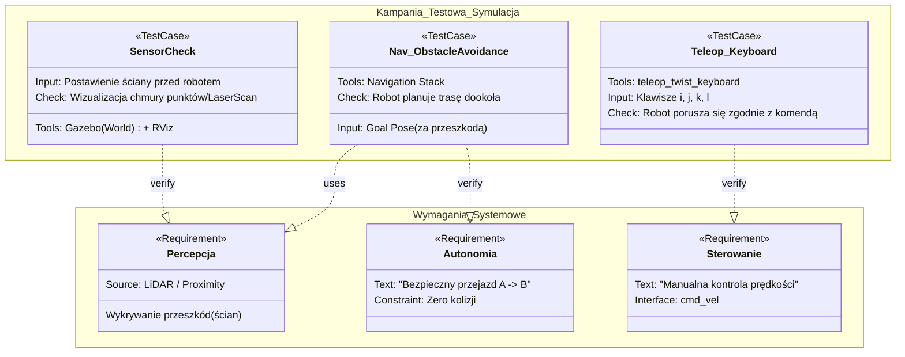

```mermaid
classDiagram
    %% --- Definicje Stylów ---
    classDef requirement fill:#FFF9C4,stroke:#FBC02D,stroke-width:2px,color:black;
    classDef testcase fill:#E1F5FE,stroke:#0288D1,stroke-width:1px,color:black;
    classDef hardware fill:#E0E0E0,stroke:#616161,stroke-width:1px,stroke-dasharray: 5 5;

    %% --- Pakiet Wymagań (Co robot ma robić?) ---
    namespace Wymagania_Systemowe {
        class Percepcja {
            <<Requirement>>
            Wykrywanie przeszkód (ścian)
            Source: LiDAR / Proximity
        }
        class Autonomia {
            <<Requirement>>
            Text: "Bezpieczny przejazd A -> B"
            Constraint: Zero kolizji
        }
        class Sterowanie {
            <<Requirement>>
            Text: "Manualna kontrola prędkości"
            Interface: cmd_vel
        }
    }

    %% --- Pakiet Testów (Twoje scenariusze) ---
    namespace Kampania_Testowa_Symulacja {
        class SensorCheck {
            <<TestCase>>
            Tools: Gazebo (World) + RViz
            Input: Postawienie ściany przed robotem
            Check: Wizualizacja chmury punktów/LaserScan
        }
        class Nav_ObstacleAvoidance {
            <<TestCase>>
            Tools: Navigation Stack
            Input: Goal Pose (za przeszkodą)
            Check: Robot planuje trasę dookoła
        }
        class Teleop_Keyboard {
            <<TestCase>>
            Tools: teleop_twist_keyboard
            Input: Klawisze i, j, k, l
            Check: Robot porusza się zgodnie z komendą
        }
    }

    %% --- Relacje Weryfikacji (Traceability) ---
    SensorCheck ..|> Percepcja : verify
    Nav_ObstacleAvoidance ..|> Autonomia : verify
    Nav_ObstacleAvoidance ..|> Percepcja : uses
    Teleop_Keyboard ..|> Sterowanie : verify

```
